# 精灵技能

## 蹦蹦种子

| 能力值 | 生命 | 物攻 | 魔攻 | 物防 | 魔防 | 速度 |
| --- | --- | --- | --- | --- | --- | --- |
| | 700 | 100 | 120 | 130 | 130 | 120 |

**紧急支援**（被动）：某个己方精灵血量低于30%时，立刻为其回复（100%自身魔攻）点血量，净化其所有负面效果并提升其25%速度（1回合）。每局对战最多触发一次。

**普通攻击**：目标为一个敌方精灵。对目标造成（100%自身物攻）点物理伤害。

**光合作用**（2）：目标为一个己方精灵。为目标回复（80%自身魔攻）点血量；若目标是自身，则额外解除随机一个负面效果。

**抗逆**（2）：目标为一个己方精灵。使目标获得20%减伤，持续2回合。

**麻醉**（3）：目标为全体敌方精灵。对所有目标造成（50%自身魔攻）点魔法伤害，并降低10%速度（2回合）。

## 上古战龙
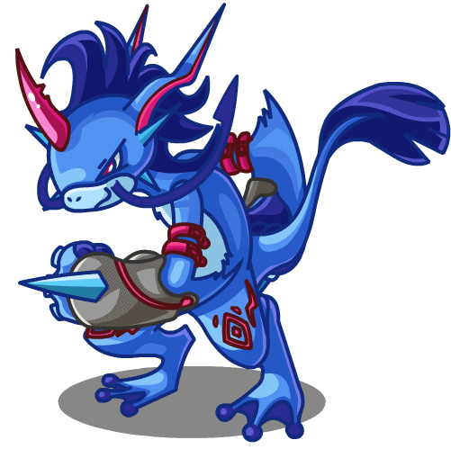

| 能力值 | 生命 | 物攻 | 魔攻 | 物防 | 魔防 | 速度 |
| --- | --- | --- | --- | --- | --- | --- |
| | 550 | 150 | 100 | 110 | 100 | 140 |

**守护者**（被动）：受到伤害时，提升自身15%物防与魔防，持续2回合。此效果每回合最多触发1次，自身回合开始时重置可触发次数。

**普通攻击**：目标为一个敌方精灵。对目标造成（100%自身物攻）点物理伤害。

**传说力量**（2）：目标为一个敌方精灵。对目标造成一段（50%自身物攻+10%目标当前生命值）点物理伤害。

**龙之舞**（3）：目标为自身。提高自身20%物攻与20%速度。

**过肩摔**（4）：目标为一个敌方精灵。对目标造成（120%自身物攻）点物理伤害，并使其眩晕1回合。

## 梦想龙
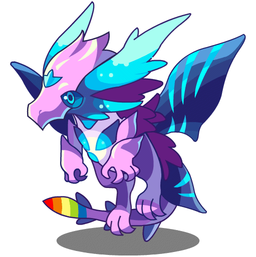

| 能力值 | 生命 | 物攻 | 魔攻 | 物防 | 魔防 | 速度 |
| --- | --- | --- | --- | --- | --- | --- |
| | 600 | 140 | 100 | 120 | 120 | 130 |

**梦想潮汐**（被动）：行动后随机获得一项正面效果和一项负面效果（物攻/魔攻/物防/魔防/速度的提升或降低10%）。自身受到的所有伤害降低（2% * 自身负面效果数，最高10%）。

**普通攻击**：目标为一个敌方精灵。对目标造成（100%自身物攻）点物理伤害。

**愿力凝聚**（3）：目标为自身。蓄力3回合：每回合提升自身10%物攻；第一、二、三回合分别降低自身10%魔攻、10%物防、10%魔防。再次释放此技能会重置蓄力进度。

**精神风暴**（2）：目标为全体敌方精灵。对所有目标造成（60%自身物攻）点物理伤害。

**命运逆转**（4）：目标为一个敌方精灵。反转自身所有能力值降低类型的负面效果，然后对目标造成（150%自身物攻）点物理伤害。

## 黑猫巫师

| 能力值 | 生命 | 物攻 | 魔攻 | 物防 | 魔防 | 速度 |
| --- | --- | --- | --- | --- | --- | --- |
| | 550 | 100 | 110 | 140 | 140 | 150 |

**共振**（被动）：自身技能固定不消耗能量，秘能上限为8点。对局开始时获得4点秘能。队友对敌方目标发动攻击时，若自身拥有不少于1点秘能，则消耗1点秘能对随机一个目标造成40点固伤的附加伤害。

**普通攻击**：目标为一个敌方精灵。对目标造成（100%自身物攻）点物理伤害。

**汲取**：目标为全体敌方精灵。对所有目标造成（20%自身魔攻）魔法伤害，然后获得（敌方精灵数量）点秘能。

**净化**：秘能不少于4点时可使用。目标为一个己方精灵。消耗4点秘能，净化目标的所有负面效果，并使其免疫负面效果（2回合）。

**星爆**：目标为全体敌方精灵。消耗全部秘能，对所有目标造成（40 + 5 * 消耗秘能数）点固伤，然后使自己眩晕2回合并获得4点秘能。

## 蒸汽神龙
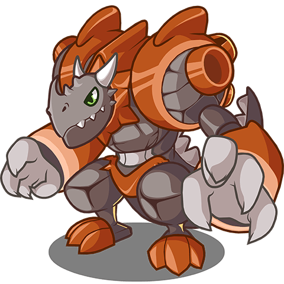

| 能力值 | 生命 | 物攻 | 魔攻 | 物防 | 魔防 | 速度 |
| --- | --- | --- | --- | --- | --- | --- |
| | 700 | 130 | 100 | 140 | 120 | 100 |

**热启动**（被动）：自身回合开始时，获得2层“升温”。

- （升温：状态效果，可叠加。自身回合内对敌人造成伤害后为其施加（自身“升温”层数）层“灼烧”。）

- （灼烧：负面效果，可叠加。携带者回合结束时，受到一次（10%×施加者物攻×层数）物理伤害，然后层数减半（向下取整）。）

**普通攻击**：目标为一个敌方精灵。对目标造成（50%自身物攻）点物理伤害，对其相邻精灵造成（25%×自身物攻）点物理伤害。

**烙印**（2）：目标为一个敌方精灵。对目标造成（50%自身物攻）点物理伤害，然后给予其5层“灼烧”。

**嗜热**（2）：目标为自身。回复自身（敌方场上所有精灵灼烧层数之和 * 8）点生命。

**沸腾**（0）：目标为自身。消耗自身（25%自身生命上限）点生命，获得4层“升温”。

## 小琮
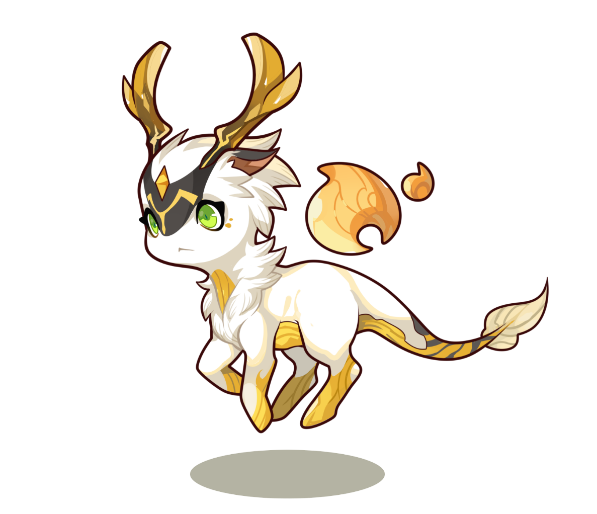

| 能力值 | 生命 | 物攻 | 魔攻 | 物防 | 魔防 | 速度 |
| --- | --- | --- | --- | --- | --- | --- |
| | 600 | 110 | 140 | 120 | 130 | 110 |

**灵珏御光**（被动）：灵珏护体，受到每段伤害时，降低（10%自身灵气层数，向下取整）点伤害，并赋予自身（实际减少的伤害值）层灵气。自身其他固定值伤害减免效果不再生效。自身死亡时，若尚无“通灵”且有灵气层数，则将生命回复至（自身灵气层数）点，并获得“通灵”。
“通灵”状态：灵珏护体，受到每段伤害时，降低（10%自身灵气层数，向下取整）点伤害，可以与其他固定值伤害减免效果同时生效。

- （灵气：状态效果，可叠加，上限为（自身基础最大生命值）层。）
- （通灵：状态效果。）

**普通攻击**：目标为一个敌方精灵。对目标造成（100%自身物攻）点物理伤害。
“通灵”状态：消耗30层灵气，对目标造成（100%自身魔攻）点魔法伤害。

**日月齐光**（3）：目标为一个敌方精灵。对目标造成（80%自身魔攻）点魔法伤害，对其相邻精灵造成（40%自身魔攻）点魔法伤害，并赋予自身30层灵气。
“通灵”状态：消耗30层灵气，对目标造成（120%自身魔攻）点魔法伤害，对其相邻精灵造成（60%自身魔攻）点魔法伤害。

**华采若英**（3）：目标为一个敌方精灵。对目标造成（80%自身魔攻+20%自身灵气层数）点魔法伤害，并赋予自身30层灵气。
“通灵”状态：消耗30层灵气，对目标造成（80%自身魔攻+20%自身灵气层数）点魔法伤害并回复（30%此伤害值）点血量。

**远举云中**（3）：目标为自身。获得10%减伤，并使“日月齐光”和“华采若英”的能量消耗减少1点，均持续3回合，期间再次使用本技能刷新持续时间；赋予自身30层灵气。
“通灵”状态：消耗30层灵气，获得15%减伤，并使“日月齐光”和“华采若英”能量消耗减少1点，均持续3回合，期间再次使用本技能刷新持续时间。

## 裘卡
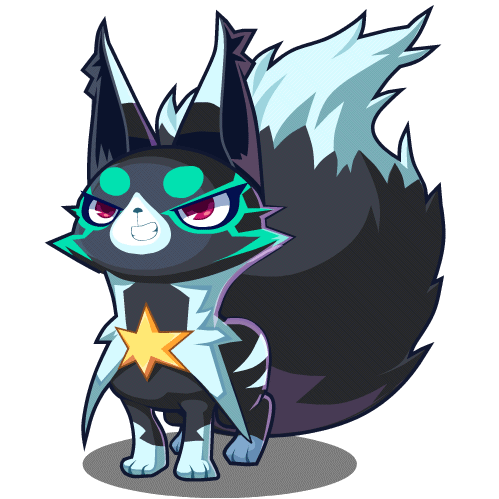

| 能力值 | 生命 | 物攻 | 魔攻 | 物防 | 魔防 | 速度 |
| --- | --- | --- | --- | --- | --- | --- |
| | 500 | 150 | 100 | 110 | 120 | 150 |

**痛苦**（被动）：造成伤害时，若目标有“中毒”效果，使此次伤害提升25%。

- （中毒：负面效果，可叠加。在回合结束时受到（1%自身生命上限 * 自身中毒层数）固定伤害，然后减少一层。）

**普通攻击**：目标为一个敌方精灵。对目标造成（100%自身物攻）物理伤害。

**毒刺**（3）：目标为全体敌方精灵。重复5次：对随机一个敌方精灵造成（25%自身物攻）物理伤害，并赋予其2层“中毒”。

**厉毒**（2）：目标为一个敌方精灵。赋予目标4层“中毒”，然后使其触发一次中毒效果。

**毒爪**（3）：目标为一个敌方精灵。对目标造成（80%自身物攻）物理伤害。目标的每层“中毒”会使此次伤害倍率提升（16%自身物攻），最多计入10层；然后使目标触发一次中毒效果。

## 凡鹰
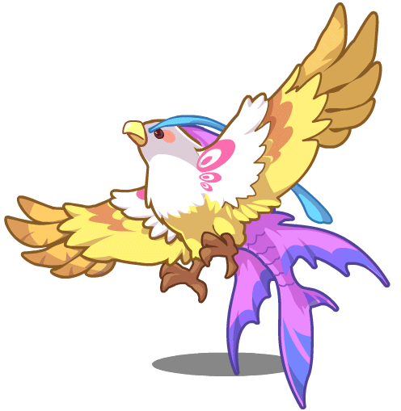

| 能力值 | 生命 | 物攻 | 魔攻 | 物防 | 魔防 | 速度 |
| --- | --- | --- | --- | --- | --- | --- |
| | 550 | 130 | 100 | 110 | 130 | 140 |

**破风**（被动）：游戏开始时，获得“破风”。

- （破风：状态效果。速度提高8%，与自身相邻的己方精灵速度提高4%。）

**普通攻击**：目标为一个敌方精灵。对目标造成（100%自身物攻）点物理伤害。

**气旋**（1）：目标为一个敌方精灵。对目标造成（80%自身物攻）点物理伤害，并使其速度降低15%，持续1回合；对目标相邻槽位的敌方精灵造成（40%自身物攻）点物理伤害。

**羽翼守护**（2）：目标为一个己方精灵。清除我方所有精灵的羽翼守护，然后使目标获得羽翼守护。

- （羽翼守护：状态效果。速度提高8%，受到伤害时使自身下一回合提前5%。）

**该你上场了**（3）：目标为场上任意精灵。使目标下一回合提前100%。如果目标为己方精灵，则使其获得20%伤害提升，持续1回合；如果目标为敌方精灵，则使其眩晕1回合。

## 缇塔

| 能力值 | 生命 | 物攻 | 魔攻 | 物防 | 魔防 | 速度 |
| --- | --- | --- | --- | --- | --- | --- |
| | 750 | 100 | 100 | 140 | 110 | 100 |

**缓存**（被动）：若我方精灵在一回合内消耗了不少于5点能量，回合结束时回复1点能量。

**普通攻击**：目标为一个敌方精灵。对目标造成（100%自身物攻）点物理伤害。

**分流**（5）：目标为自身。获得2层分流。若已拥有分流，则将层数置为2。

- （分流：状态效果，可叠加。己方精灵回合结束后，回复1点能量。自身回合开始时减少1层。）

**扩容**（5）：目标为自身。获得1层扩容。

- （扩容：状态效果，可叠加，最多5层。使己方能量上限提升（自身扩容层数）点。）

**过载**（3）：目标为一个敌方精灵。对目标造成（175%自身魔攻）点魔法伤害，然后使目标与自身的速度降低30%，持续1回合。

## 诡法师

| 能力值 | 生命 | 物攻 | 魔攻 | 物防 | 魔防 | 速度 |
| --- | --- | --- | --- | --- | --- | --- |
| | 600 | 100 | 130 | 130 | 130 | 110 |

**塔罗**（被动）：游戏开始时，在牌堆中加入「太阳」「月亮」「星星」「节制」「审判」「战车」「高塔」「隐士」「死神」「愚者」「恶魔」各 1 张。每回合开始时从牌堆随机抽 3 张入手牌；回合结束时将所有未被消耗的手牌洗回牌堆。

**普通攻击**：目标为一个敌方精灵。对目标造成（100%自身物攻）点物理伤害。

**占卜**（1）：目标为自身。从牌堆中随机抽1张牌。然后插入一次额外行动：执行占卜、揭晓、逆位或跳过。

**揭晓**（1）：目标随打出的牌而定（见牌面；需选目标的牌在打出时再选）。打出1张手牌（该牌洗回牌堆）并触发牌面效果。然后插入一次额外行动：执行占卜、揭晓、逆位或跳过。打出牌面效果：

- 太阳：目标为自身。使自身造成的伤害提高24%，持续1回合。
- 月亮：目标为自身。使自身下一回合提前24%，并在自身下个回合开始时回复1点能量。此效果不可叠加。
- 星星：目标为一个己方精灵。为目标回复（48%自身魔攻）点生命值。
- 节制：目标为一个敌方精灵。使目标降低9%物攻、魔攻、物防与魔防，持续1回合。
- 审判：目标为一个敌方精灵。对目标造成（96%自身魔攻）点魔法伤害，并使其行动延后20%。
- 高塔：目标为一个己方精灵。使目标提升18%物攻与魔攻，持续1回合。
- 战车：目标为一个己方精灵。使目标提升18%物防与魔防，持续1回合。
- 隐士：目标为一个己方精灵。使目标提升18%速度，持续1回合。
- 死神：目标为全体敌方精灵。对所有目标造成（48%自身魔攻）点魔法伤害。
- 愚者：目标为自身。抽2张牌。
- 恶魔：目标为自身。消耗若干张手牌，再抽取等量的牌。消耗的牌不会进入牌堆。

**逆位**（2）：目标为自身。将一张牌变化为指定的另一种牌。然后插入一次额外行动：执行占卜、揭晓、逆位或跳过。

## 翠顶夫人

| 能力值 | 生命 | 物攻 | 魔攻 | 物防 | 魔防 | 速度 |
| --- | --- | --- | --- | --- | --- | --- |
| | 700 | 100 | 100 | 130 | 130 | 140 |

**澄净**（被动）：治疗我方精灵时，若其有“浸润”效果，则回复1点能量；否则赋予其“浸润”，持续1回合。

- （浸润：正面效果。）

**普通攻击**：目标为一个敌方精灵。对目标造成（100%自身物攻）点物理伤害。

**暖流**（3）：目标为一个己方精灵。为目标和与其相邻精灵回复（10%自身最大生命）点生命。

**涟漪**（3）：目标为全体敌方精灵。对所有目标造成（8%自身最大生命）点魔法伤害，并随机驱散其各一个正面效果。

**共舞**（5）：目标为全体己方精灵。为所有目标回复（10%自身最大生命）点生命；然后使除自己外的所有目标立刻获得一次额外行动，行动顺序按照队伍编号由小到大的顺序；然后使所有目标下一回合延后50%。

## 大耳帽兜

| 能力值 | 生命 | 物攻 | 魔攻 | 物防 | 魔防 | 速度 |
| --- | --- | --- | --- | --- | --- | --- |
| | 600 | 120 | 110 | 140 | 140 | 120 |

**纯白**（被动）：释放技能时，若目标的正面效果数为2或3，则随机清除其1个正面效果；若为4或更多，则随机清除其2个正面效果。

**普通攻击**：目标为一个敌方精灵。对目标造成（100%自身物攻）点物理伤害。

**轻雾**（2）：目标为一个敌方精灵。使目标所有技能能耗+1，持续3回合。若目标已有此效果，则重置持续时间。

**飞霰**（2）：目标为一个敌方精灵。赋予目标6层“冰冻”，并赋予目标相邻精灵3层“冰冻”。

- （冰冻：负面效果，可叠加。回合结束时，如果自身生命值不高于（1%自身最大生命值 * 自身“冰冻”层数），则立刻阵亡。）

**萌化**（4）：目标为一个敌方精灵。使目标造成的伤害降低33%，持续2回合。

## 巴哈姆特

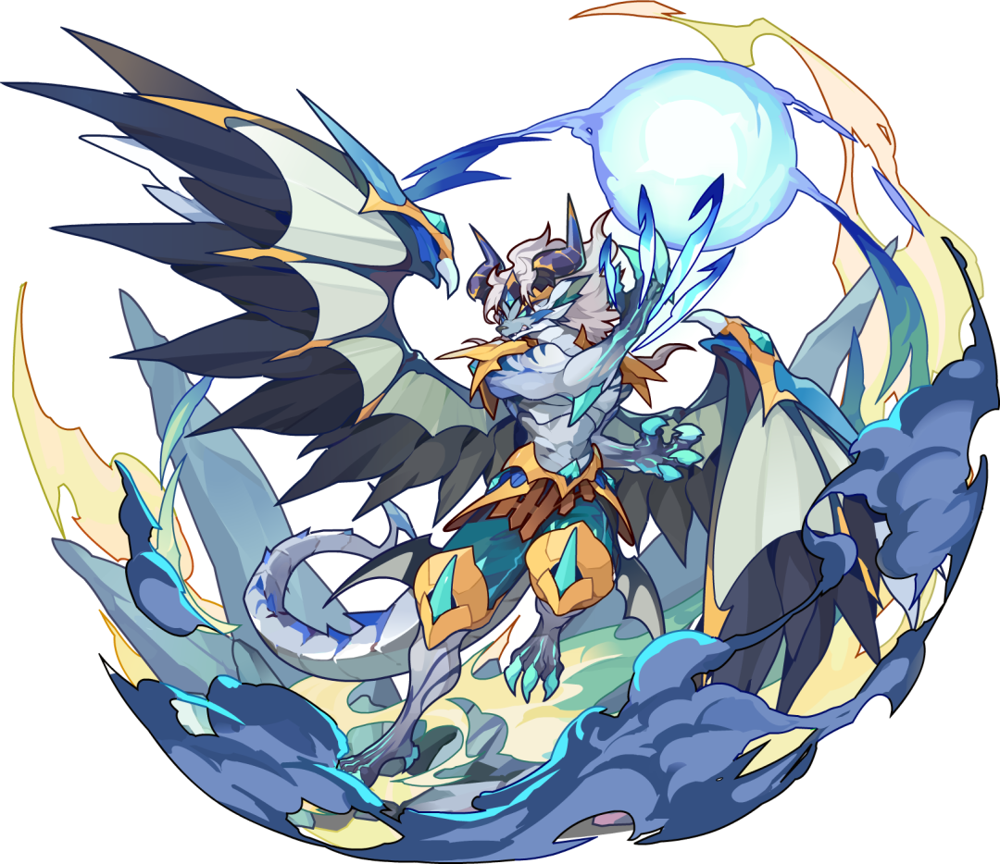

| 能力值 | 生命 | 物攻 | 魔攻 | 物防 | 魔防 | 速度 |
| --- | --- | --- | --- | --- | --- | --- |
| | 550 | 140 | 100 | 140 | 140 | 120 |

**气蕴沧溟**（被动）：战斗开始时，赋予自身10层“罡气”；若自身处于队伍首位，赋予自身“彻甲”；否则赋予自身“寸劲”。

- （罡气：状态效果，可叠加，最多10层。）

- （彻甲：状态效果。对敌方精灵释放普攻或技能时，若自身拥有“罡气”且目标“驱邪”层数小于4层，则移除自身1层“罡气”，并赋予目标1层“驱邪”。对拥有2/3/4层“驱邪”的目标造成伤害时，此伤害暴击率提升20%/30%/40%，暴击效果提升50%。）

- （寸劲：状态效果。对敌方精灵释放普攻或技能时，若自身拥有“罡气”且目标“镇煞”层数小于2层，则移除自身1层“罡气”，并赋予目标1层“镇煞”。受到拥有2层“镇煞”的目标造成的伤害时，获得一层“招架”。）

- （驱邪：状态效果，可叠加，最多4层。）

- （镇煞：状态效果，可叠加，最多2层。）

- （招架：状态效果，可叠加，最多5层。受到的伤害降低（5% * （自身“招架”层数））。若自身已有“招架”，受到伤害时再获得1层“招架”。在自身回合开始时，若自身拥有“招架”，则获得一次额外行动：使用技能“截拳”或“反扑”。）

**截拳**（0）：特殊技能。目标为一个敌方精灵。对目标造成（自身“招架”层数）段物理伤害，每段倍率为（30%自身物攻），并消耗所有“招架”。

**反扑**（0）：特殊技能。目标为一个敌方精灵。对目标造成（30%自身物攻）点物理伤害，然后重复（自身“招架”层数）次：对随机一个敌方精灵造成（30%自身物攻）点物理伤害；然后消耗所有“招架”。

**普通攻击**：目标为一个敌方精灵。对目标造成（100%自身物攻）点物理伤害。

**疾风拳**（1）：目标为一个敌方精灵。对目标造成3段物理伤害，每段倍率为（50%自身物攻）。

**迎击**（1）：目标为自身。使目标获得1层“招架”。

**龙之舞**（3）：目标为自身。使目标提高20%物攻与20%速度。

## 尖嘴狐仙

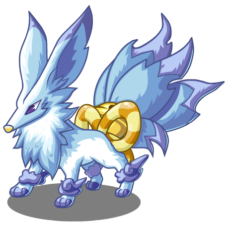

| 能力值 | 生命 | 物攻 | 魔攻 | 物防 | 魔防 | 速度 |
| --- | --- | --- | --- | --- | --- | --- |
| | 500 | 120 | 100 | 140 | 150 | 140 |

**内爆**（被动）：给予“灼烧”效果时，触发目标的“中毒”效果；给予“中毒”效果时，触发目标的“灼烧”效果。

**普通攻击**：目标为一个敌方精灵。对目标造成（100%自身物攻）点物理伤害。

**烙印**（2）：目标为一个敌方精灵。对目标造成（50%自身物攻）点物理伤害，然后赋予其5层“灼烧”。

**鬼火**（3）：目标为一个敌方精灵。赋予目标4层“中毒”，然后赋予其4层“灼烧”。

**扇风**（3）：目标为一个敌方精灵。赋予目标4层“灼烧”，然后赋予目标相邻精灵等同于目标“灼烧”总层数一半（向下取整）层数的“灼烧”。

## 帕尔萨斯

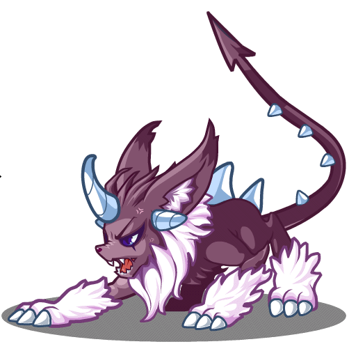

| 能力值 | 生命 | 物攻 | 魔攻 | 物防 | 魔防 | 速度 |
| --- | --- | --- | --- | --- | --- | --- |
| | 650 | 130 | 100 | 120 | 120 | 120 |

**收藏灵魂**（被动）：自身技能固定不消耗能量。对局开始时获得2点秘能，秘能上限为20点。自身成为普攻或技能的唯一目标时，回复2点秘能。当自身秘能从小于13点增长至大于等于13点时，使自身下回合提前100%，并使自身的“恐怖”效果延长1回合。

**普通攻击**：目标为一个敌方精灵。对目标造成（100%自身物攻）点物理伤害，并回复1点秘能。

**恶魔契约**：目标为自身。消耗自身当前生命值的10%，回复3点秘能。

**巨魔之眼**：秘能不少于7点时可以使用。目标为一个敌方精灵。消耗7点秘能，赋予自身“恐怖”效果，持续3回合；然后对目标造成（120%自身魔攻）魔法伤害。

- （恐怖：正面效果。携带者造成伤害时，无视10%的魔防。持续期间再次获得此效果会重置持续时间。）

**新月乱舞**：秘能不少于13点时可以使用。目标为一个敌方精灵。消耗13点秘能，对目标造成（120%自身魔攻）魔法伤害，随后对全体敌方精灵造成（80%自身魔攻）魔法伤害。

## 圣域祭司

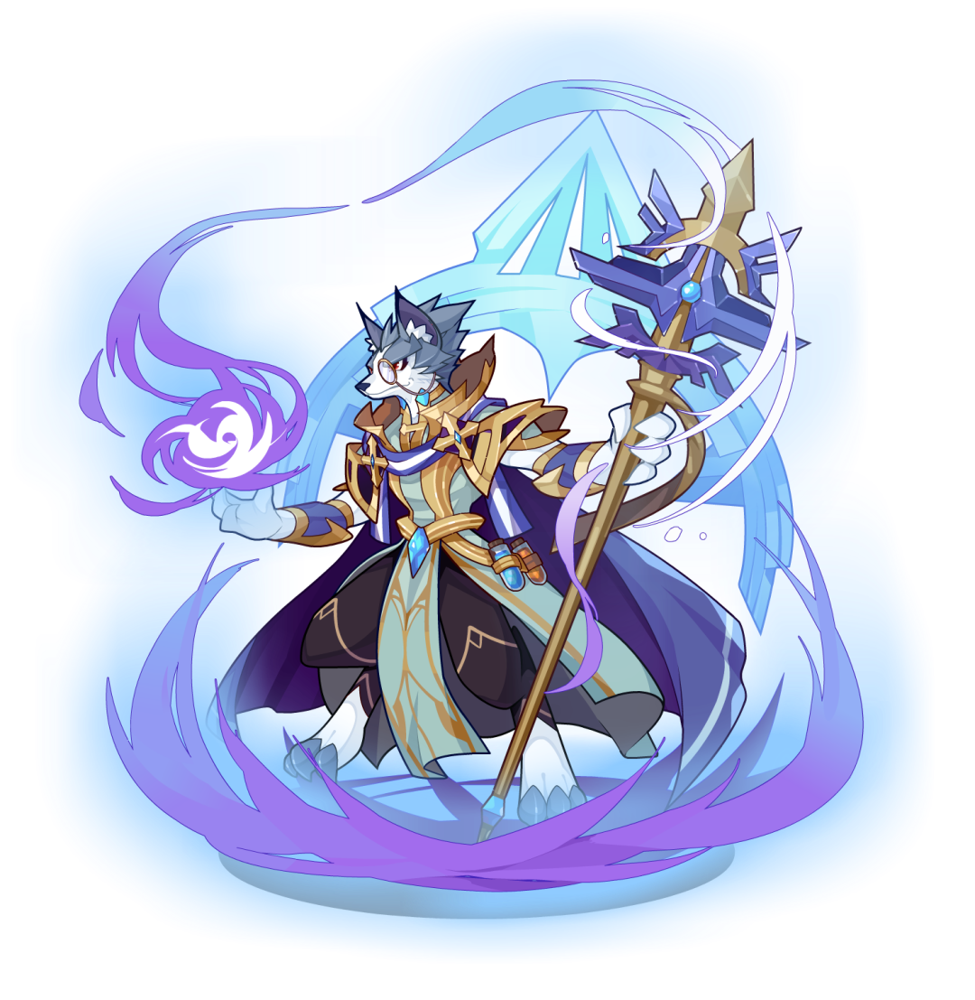

| 能力值 | 生命 | 物攻 | 魔攻 | 物防 | 魔防 | 速度 |
| --- | --- | --- | --- | --- | --- | --- |
| | 500 | 110 | 140 | 130 | 150 | 100 |

**月盈**（被动）：自身技能固定不消耗能量。秘能上限为5点。回合开始时获得5点秘能；回合结束时，消耗所有秘能，使自身速度提高（20*消耗秘能点数）%，持续2回合。己方精灵获得秘能后，使其额外获得1点秘能。

**普通攻击**：目标为一个敌方精灵。对目标造成（100%自身物攻）点物理伤害。

**圣洁**：秘能不少于2点时可以使用。目标为一个己方精灵。消耗2点秘能，为目标回复（60%自身魔攻）点血量与1点秘能。

**指引**：秘能不少于4点时可以使用。目标为一个敌方精灵。消耗4点秘能，使目标受到的伤害提高16%，持续3回合。

**再现**：秘能不少于5点时可以使用。目标为一个敌方精灵。消耗5点秘能，将目标的随机一个能力值降低、造成伤害降低或受到伤害提高类型的负面效果复制给除目标外的敌方所有精灵，复制出的负面效果无法再次被复制。

## 梅花德尔勒

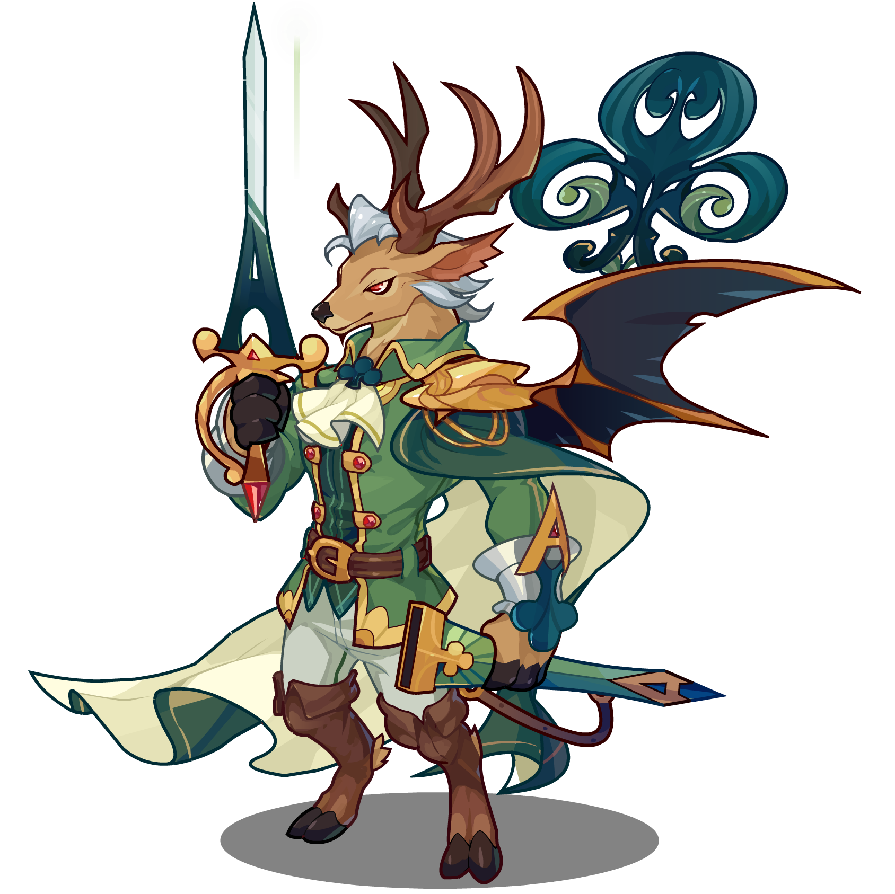

| 能力值 | 生命 | 物攻 | 魔攻 | 物防 | 魔防 | 速度 |
| --- | --- | --- | --- | --- | --- | --- |
| | 550 | 120 | 100 | 130 | 130 | 140 |

**看破**（被动）：战斗开始时，赋予随机两个敌方精灵“破绽”效果，持续3回合。对敌方目标释放普通攻击时，若目标拥有“破绽”，则清除其一条“破绽”（优先清除持续时间较短的“破绽”），并赋予除目标外随机两个敌方精灵“破绽”，持续3回合。

-（破绽：负面效果。物防降低5%。）

**普通攻击**：目标为一个敌方精灵。对目标造成（100%自身物攻）点物理伤害。

**剑花**（3）：目标为自身。若拥有“剑舞”，则将“剑舞”的持续时间重置为5回合，并叠加一层“剑舞”；否则获得1层“剑舞”，持续5回合。被动效果：游戏开始时，获得1层“剑舞”，持续5回合。

- （剑舞：状态效果，可叠加，最多6层。每层提升5%物攻与20%速度；释放普通攻击后叠加一层“剑舞”，不重置持续时间。）

**穿刺**（1）：目标为一个敌方精灵。赋予目标“破绽”，持续3回合；然后对目标造成（100%自身物攻）物理伤害。

**敏锐**（1）：目标为全体敌方精灵。对所有目标造成（25%自身物攻）物理伤害；然后赋予所有拥有不少于3条“破绽”，且未拥有“漏洞百出”效果的目标“漏洞百出”。

-（漏洞百出：状态效果。施加者对持有者释放普通攻击时，此次普通攻击伤害提高25%，并使施加者获得一次额外行动；随后解除持有者的此效果。）

## 藤椒小巴

| 能力值 | 生命 | 物攻 | 魔攻 | 物防 | 魔防 | 速度 |
| --- | --- | --- | --- | --- | --- | --- |
| | 700 | 140 | 100 | 110 | 110 | 120 |

**热火朝天**（被动）：我方精灵每消耗1点能量，藤椒小巴都会积攒1层“火力”。当“火力”达到10/20/30层时，藤椒小巴会获得一次额外行动：可释放“出锅！”技能，且菜品分别固定为“辣子鸡”/“水煮鱼”/“毛血旺”，此次技能不消耗能量。

**普通攻击**：目标为一个敌方精灵。对目标造成（100%自身物攻）物理伤害。

**浇油**（2）：目标为自身。获得5层“火力”；提升自身20%物攻，持续3回合。

**炝锅**（2）：目标为自身。延长场上所有菜品效果持续时间1回合，但不会超过菜品效果原本的持续时间。

**出锅！**（3）：小巴随机端出一道川菜，触发不同效果：

- 辣子鸡：目标为一个己方精灵。赋予目标“辣子鸡”正面效果，持续3回合：基于施加者物攻的10%，提升携带者物攻与魔攻；持续期间再次获得此效果会重置持续时间。

- 水煮鱼：目标为自身。赋予目标“水煮鱼”正面效果，持续2回合：基于携带者物攻的10%，提升所有队友的物攻与魔攻；持续期间再次获得此效果会重置持续时间。

- 毛血旺：目标为全体敌方精灵。消耗全部“火力”，每消耗3层“火力”，就给予所有目标1层“灼烧”；然后给予所有目标“毛血旺”负面效果，持续3回合：受到的持续伤害提高15%，持续期间再次获得此效果会重置持续时间。

三种菜品出现的权重相等。当自身没有“水煮鱼”效果时，“水煮鱼”菜品出现的权重翻倍。当自身“火力”不小于20层时，“毛血旺”菜品出现的权重翻倍。

## 呱呱

| 能力值 | 生命 | 物攻 | 魔攻 | 物防 | 魔防 | 速度 |
| --- | --- | --- | --- | --- | --- | --- |
| | 600 | 120 | 120 | 120 | 120 | 120 |

**必有我师**（被动）：游戏开始时，若自身不处于我方首位，使我方首位精灵获得“师傅”状态效果。场上存在“师傅”时，自身双攻提高10%，攻击伤害的暴击率提升20%，暴击效果提升40%。师傅发动攻击后，自身获得一次额外行动，自动对此次攻击的随机一个目标释放特殊技能“学会了！”；若不存在这样的目标，则以随机一个敌方精灵为目标；此效果最多可触发1次，自身回合开始时重置可触发次数。

**学会了！**（特殊技能）：目标为一个敌方精灵。对目标造成（48%自身物攻）物理伤害；使“师傅”也获得自身“必有我师”的双攻、暴击率和暴击效果提升效果，持续2回合。

**普通攻击**：目标为一个敌方精灵。对目标造成（100%自身物攻）物理伤害。

**师傅请喝茶**（2）：目标为除自身外的一个己方精灵。清除我方所有精灵的“师傅”状态效果；使目标获得“师傅”效果；使自身速度提高10%，持续2回合。

**百家拳法**（2）：目标为一个敌方精灵。对目标造成（100%自身物攻）物理伤害；若场上存在师傅，使师傅对目标造成一段（48%师傅双攻的较高值）对应属性附加伤害。

**学神不学形**（3）：目标为自身。使自身获得“学神”状态效果，持续5回合，期间再次获得此效果会重置持续时间：自身发动攻击后，若场上存在师傅，使师傅对此次攻击的随机一个目标造成一段（32%师傅双攻的较高值）对应属性附加伤害；若不存在这样的目标，则以随机一个敌方精灵为目标。

## 恶魔战士

| 能力值 | 生命 | 物攻 | 魔攻 | 物防 | 魔防 | 速度 |
| --- | --- | --- | --- | --- | --- | --- |
| | 750 | 100 | 100 | 120 | 130 | 110 |

**肉盾**（被动）：基于自身物防与魔防之和的8%，提高全体己方精灵的物防与魔防；自身受到的伤害提高50%。

**普通攻击**：目标为一个敌方精灵。对目标造成（100%自身物攻）物理伤害。

**血墙**：此技能固定不消耗能量。目标为自身。消耗10%最大生命值（不致死），获得“血墙”正面效果，持续4回合，期间再次获得此效果会重置持续时间：提高自身50%双防。

**狂宴**（3）：目标为自身。回复（33%自身已损生命）生命。

**临行留念**：此技能固定不消耗能量。目标为全体敌方精灵。对所有目标造成（50%自身魔攻+10%自身当前生命）魔法伤害；使自身死亡。

（未实现）
## 格鲁姆

| 能力值 | 生命 | 物攻 | 魔攻 | 物防 | 魔防 | 速度 |
| --- | --- | --- | --- | --- | --- | --- |
| | 700 | — | — | — | — | — |

**养分输送**（被动）：队友受到伤害时：若自身生命值比例高于50%，则为队友回复（5%自身最大生命值）点生命值；否则为自己回复（5%自身最大生命值）点生命值。

**普通攻击**：目标为一个敌方精灵。对目标造成（100%自身物攻）点物理伤害。

**深根**（5）：目标为自身。获得“深根”，持续3回合，期间再次使用此技能会重置“深根”持续时间。

- （深根：状态效果。速度降低30%，队友受到伤害时自身分担50%的伤害，分担的伤害不能被减免。）

**寄生**（2）：目标为一个敌方精灵。对目标造成（100%自身魔攻）点魔法伤害，并回复自身等同于此次伤害值的血量。

**紧缠**（3）：目标为一个敌方精灵。降低其15%物攻与魔攻，持续2回合。

（未实现）
## 长夜月

| 能力值 | 生命 | 物攻 | 魔攻 | 物防 | 魔防 | 速度 |
| --- | --- | --- | --- | --- | --- | --- |
| | 800 | 100 | 100 | 120 | 120 | 120 |

**月夜之契**（被动）：场上最多存在 1 只自身的召唤物「月影」。召唤物继承自身 50% 的生命能力值和 100% 的其他能力值（物攻、魔攻、物防、魔防、速度）。召唤物被击败时，自身行动提前 50%。

- （月影：长夜月的召唤物，视为独立场上单位，拥有独立生命值与时间轴；可被选为技能目标，参与「我方全体」「敌方全体」等范围结算。不受队伍 5 格编队上限约束。长夜月被击败时，月影立刻离场。）

**普通攻击**：目标为一个敌方精灵。对目标造成（100%自身物攻）点物理伤害。

**渴慕**（3）：无目标。若自身召唤物「月影」未在场，召唤「月影」并使其以 25% 最大生命值登场，然后使其行动提前 100%；否则为「月影」回复（25%「月影」最大生命值）点生命并回复2点能量。

**呼唤**（3）：目标为全体敌方精灵。对所有目标造成（13%自身最大生命值）点魔法伤害。若自身召唤物「月影」在场，为其回复（25%「月影」最大生命值）点生命，并使其立刻获得一次额外行动。

**同辉**（3）：目标为自身。获得“至黯之谜”，持续 2 回合。若「月影」在场，则赋予其“至黯之谜”，持续 2 回合。“至黯之谜”持续回合内再次获得会重置持续回合数。

-（至黯之谜：速度与最大生命值提高 10%；若自身为召唤物，效果翻倍。）

**月影**（召唤物）

**普通攻击**：目标为一个敌方精灵。对目标造成（100%自身物攻）点物理伤害。

**陨落**（0）：目标为全体敌方精灵。对所有目标造成（80%自身当前生命值）点魔法伤害，然后消耗自身全部生命值（视为被击败）。

（未实现）
## 雪怪

| 能力值 | 生命 | 物攻 | 魔攻 | 物防 | 魔防 | 速度 |
| --- | --- | --- | --- | --- | --- | --- |
| | 500 | 150 | 150 | 150 | 150 | 150 |

**滚雪球**（被动）：自身回合开始时，获得一层积雪。

- （积雪：状态效果，可叠加，最多8层。）

**普通攻击**：目标为一个敌方精灵。对目标造成（50%自身物攻）点物理伤害；然后重复（2+自身积雪层数）次：随机对上一次受到自身伤害的精灵左侧或右侧相邻的精灵造成（25%自身物攻）点物理伤害；然后清空自身积雪。

（未实现）
## 皇家狮鹫

